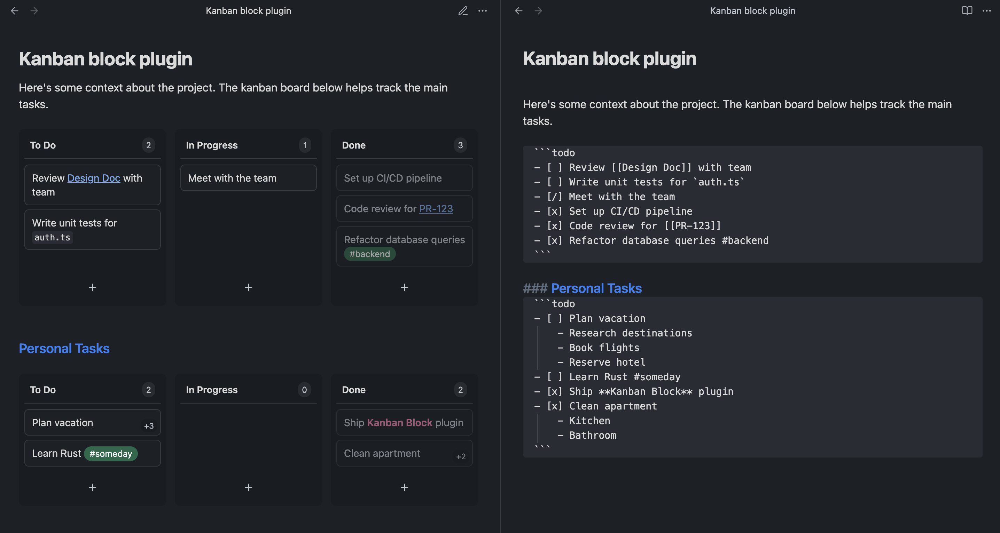

# Kanban Block

A simple Obsidian plugin that renders todo checkboxes as an interactive kanban board.


## Usage

Create a `todo` code block with checkbox items:

~~~markdown
```todo
- [ ] Review [[Design Doc]] with team
- [ ] Write unit tests for `auth.ts`
- [/] Meet with the team
- [x] Set up CI/CD pipeline
- [x] Code review for [[PR-123]]
- [x] Refactor database queries #backend
```
~~~

This renders as a 3-column kanban board:



### Syntax

- `[ ]` → **To Do**
- `[/]` → **In Progress**
- `[x]` → **Done**

### Features

- Drag and drop between columns
- Reorder within columns
- Changes sync back to markdown in real-time
- "+" buttons to add new items in columns
- Double click on item to edit it
- Leave empty text in item to remove it
- Supports wiki links, bold, italic, code, and tags
- Nested items move with their parent (shown with `+N` badge)
- Detect non-checkbox lines and ignore them (with warning)
- Plugin settings where column names can be changed

## Manual Installation

1. Download `main.js`, `manifest.json`, and `styles.css` from the [latest release](https://github.com/ldomaradzki/obsidian-kanban-block/releases)
2. Create folder: `.obsidian/plugins/kanban-block/`
3. Copy the downloaded files into that folder
4. Reload Obsidian
5. Enable in Settings → Community Plugins

## Development

```bash
npm install
npm run dev    # Watch mode
npm run build  # Production build
```

## License

MIT
